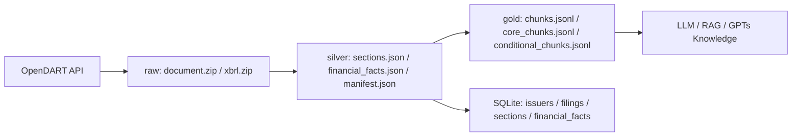

# kstock-for-llm

[](#requirements)
[](LICENSE)
[](https://opendart.fss.or.kr/)

OpenDART 기반으로 한국 상장사의 사업보고서를 수집하고, LLM/RAG가 바로 다룰 수 있는 `raw -> silver -> gold` 데이터로 정규화하는 Python 파이프라인입니다.

이 저장소는 한국 기업 공시를 “사람이 읽는 문서”에서 “검색·질의·검증 가능한 지식 파일”로 바꾸는 데 초점을 둡니다. 특히 사업보고서의 `II. 사업의 내용`을 GPTs 지식 파일로 만들거나, 단일 회사의 사업보고서 원문·XBRL·재무 fact·섹션 chunk를 함께 보관하는 흐름을 제공합니다.

> 이 프로젝트는 투자 자문이 아닙니다. 생성된 데이터와 답변은 원문 공시와 함께 검증해야 합니다.

## 목차

- [주요 기능](#주요-기능)
- [OpenDART 연결 구조](#opendart-연결-구조)
- [Requirements](#requirements)
- [Quickstart](#quickstart)
- [산출물 구조](#산출물-구조)
- [CLI 사용법](#cli-사용법)
- [테스트](#테스트)
- [공개 저장소 운영 메모](#공개-저장소-운영-메모)
- [기여와 보안](#기여와-보안)
- [라이선스](#라이선스)

## 주요 기능

- `stock_code` 또는 OpenDART `corp_code`로 회사 식별
- 특정 사업연도의 최신 사업보고서 탐색
- 공시 원문 XML ZIP 저장
- 재무제표 XBRL ZIP 저장
- 사업보고서 섹션 파싱 후 JSON/SQLite 적재
- 전체 재무제표 fact를 JSON/SQLite로 정규화
- RAG용 `chunks.jsonl`, 기본 검색용 `core_chunks.jsonl`, 조건부 검색용 `conditional_chunks.jsonl` 생성
- 코스피/코스닥 사업보고서의 `II. 사업의 내용`만 모아 GPTs 지식 업로드용 Markdown shard 생성
- 긴 배치 실행을 위한 `progress.json`, partial JSONL, 실패 로그 기록



## OpenDART 연결 구조

이 프로젝트는 금융감독원 OpenDART 공식 API를 직접 호출합니다.

| 단계 | OpenDART API | 프로젝트에서의 역할 |
| --- | --- | --- |
| 회사 식별 | [고유번호 `corpCode.xml`](https://opendart.fss.or.kr/guide/detail.do?apiGrpCd=DS001&apiId=2019018) | 종목코드 6자리와 OpenDART 회사고유번호 8자리를 연결합니다. |
| 회사 정보 | [기업개황 `company.json`](https://opendart.fss.or.kr/guide/detail.do?apiGrpCd=DS001&apiId=2019002) | 결산월, 법인구분 등 보고서 선택에 필요한 메타데이터를 보강합니다. |
| 공시 탐색 | [공시검색 `list.json`](https://opendart.fss.or.kr/guide/detail.do?apiGrpCd=DS001&apiId=2019001) | 정기공시(`A`), 사업보고서 상세유형(`A001`)을 기준으로 후보를 찾습니다. |
| 원문 다운로드 | [공시서류원본파일 `document.xml`](https://opendart.fss.or.kr/guide/detail.do?apiGrpCd=DS001&apiId=2019003) | 접수번호(`rcept_no`)로 사업보고서 원문 ZIP을 받습니다. |
| XBRL 다운로드 | [재무제표 원본파일 `fnlttXbrl.xml`](https://opendart.fss.or.kr/guide/detail.do?apiGrpCd=DS003&apiId=2019019) | 사업보고서 코드 `11011`로 XBRL ZIP을 받습니다. 없으면 건너뜁니다. |
| 재무 fact | [단일회사 전체 재무제표 `fnlttSinglAcntAll.json`](https://opendart.fss.or.kr/guide/detail.do?apiGrpCd=DS003&apiId=2019020) | 연결(`CFS`)과 별도(`OFS`) 전체 계정과목을 가져옵니다. |

OpenDART의 ZIP 응답은 정상일 때 binary ZIP으로 내려오고, 오류일 때 XML status 메시지로 내려올 수 있습니다. 이 클라이언트는 두 경우를 구분해 처리하며, OpenDART 요청 제한 초과(`020`)와 데이터 없음(`013`) 같은 상태 코드를 오류 흐름에 반영합니다.

## Requirements

- Python 3.10+
- OpenDART API 인증키
- 현재 vertical slice는 표준 라이브러리만 사용합니다. `requirements.txt`는 향후 의존성 관리를 위해 유지합니다.

OpenDART 인증키는 [OpenDART](https://opendart.fss.or.kr/)에서 발급받아 환경변수로 설정하세요. `.env`는 `.gitignore`에 포함되어 있으므로 공개 저장소에 올라가지 않습니다.

## Quickstart

### 1. 저장소 준비

```bash
git clone https://github.com/cranesun1226/kstock-for-llm.git
cd kstock-for-llm

python3 -m venv .venv
source .venv/bin/activate
python3 -m pip install -r requirements.txt
```

로컬 실행이 잦다면 `PYTHONPATH`를 한 번 설정해두면 편합니다.

```bash
export PYTHONPATH=src
python3 -m opendart --help
```

### 2. 환경변수 설정

```bash
cp .env.example .env
```

`.env`를 열어 본인의 인증키를 넣습니다.

```dotenv
OPENDART_API_KEY=your_opendart_api_key_here
OPENDART_DATA_DIR=data
OPENDART_DB_PATH=data/opendart.db
```

### 3. 단일 회사 사업보고서 동기화

삼성전자 2025 사업보고서를 예시로 동기화합니다.

```bash
PYTHONPATH=src python3 -m opendart sync-report --stock-code 005930 --year 2025
```

정상 실행 후에는 아래 계층의 파일과 SQLite 레코드가 생성됩니다.

- `data/opendart.db`
- `data/raw/<stock_code>/<year>/<filing_key>/document.zip`
- `data/raw/<stock_code>/<year>/<filing_key>/xbrl.zip`
- `data/silver/<stock_code>/<year>/<filing_key>/sections.json`
- `data/silver/<stock_code>/<year>/<filing_key>/financial_facts.json`
- `data/silver/<stock_code>/<year>/<filing_key>/manifest.json`
- `data/gold/<stock_code>/<year>/<filing_key>/chunks.jsonl`
- `data/gold/<stock_code>/<year>/<filing_key>/core_chunks.jsonl`
- `data/gold/<stock_code>/<year>/<filing_key>/conditional_chunks.jsonl`
- `data/gold/<stock_code>/<year>/<filing_key>/qa_checks.json`

### 4. 전종목 `II. 사업의 내용` GPT 지식 파일 생성

전종목 사업 설명만 GPTs 지식에 넣고 싶을 때는 별도 배치 명령을 사용합니다. 이 명령은 사업보고서 원문에서 `II. 사업의 내용` 하위 섹션만 추출해 Markdown shard로 저장합니다.

```bash
PYTHONPATH=src python3 -m opendart build-business-knowledge
```

기본값은 다음과 같습니다.

| 항목 | 기본값 |
| --- | --- |
| 시장 | 코스피(`Y`) + 코스닥(`K`) |
| 검색 기간 | 실행일 기준 최근 455일 |
| 보고서 선택 | 종목별 최신 사업보고서 기간 우선 |
| 후보 우선순위 | `[기재정정]사업보고서` > 일반 `사업보고서` > `[첨부정정]사업보고서` |
| 출력 위치 | `data/gold/business_knowledge/YYYYMMDD/` |
| GPT 업로드용 파일 | `business_sections_001.md`, `business_sections_002.md`, ... |
| 보조 파일 | `business_sections.jsonl`, `failures.jsonl`, `manifest.json` |
| 중간 저장 | `progress.json`, `inventory.json`, `business_sections.partial.jsonl`, `failures.partial.jsonl` |

예시:

```bash
PYTHONPATH=src python3 -m opendart build-business-knowledge \
  --business-year 2025 \
  --end-date 2026-04-29 \
  --lookback-days 455 \
  --checkpoint-every 1 \
  --max-files 20 \
  --max-chars-per-file 5000000
```

테스트용으로 일부 종목만 처리하려면 inventory 수집 후 앞 N개만 다운로드합니다.

```bash
PYTHONPATH=src python3 -m opendart build-business-knowledge --limit 10
```

GPTs 지식 업로드에는 `.jsonl`보다 `.md` 파일을 우선 사용하세요. Markdown shard는 각 회사 블록에 종목코드, 회사명, 시장, 접수번호, DART 원문 링크를 함께 넣습니다.

## 산출물 구조

| 계층 | 파일/테이블 | 설명 |
| --- | --- | --- |
| `raw` | `document.zip`, `xbrl.zip` | OpenDART 원문을 가능한 한 그대로 보관합니다. |
| `silver` | `sections.json`, `financial_facts.json`, `manifest.json` | 파싱·정규화된 중간 산출물입니다. |
| `gold` | `chunks.jsonl`, `core_chunks.jsonl`, `conditional_chunks.jsonl`, `qa_checks.json` | LLM/RAG 소비를 위한 최종 산출물입니다. |
| SQLite canonical | `issuers`, `filings`, `sections`, `financial_facts`, `filing_artifacts` | 회사, 공시, 섹션, 재무 fact, 파일 artifact를 조회합니다. |
| SQLite derived | `section_chunks`, `qa_checks` | 검색 chunk와 품질 점검 결과를 조회합니다. |
| SQLite operations | `sync_runs` | 동기화 실행 이력을 기록합니다. |

`core_chunks.jsonl`은 기본 검색 pool입니다. `conditional_chunks.jsonl`은 감사, 주주, 지배구조, 대주주 거래처럼 질문 의도가 맞을 때 추가로 여는 pool입니다.

현재 chunk 우선순위는 다음처럼 구분합니다.

| 우선순위 | 포함 섹션 |
| --- | --- |
| `core` | `I. 회사의 개요`, `II. 사업의 내용`, `III. 재무에 관한 사항`, `IV. 이사의 경영진단 및 분석의견`, `XI. 그 밖에 투자자 보호를 위하여 필요한 사항` |
| `conditional` | `V. 회계감사인의 감사의견 등`, `VII. 주주에 관한 사항`, `X. 대주주 등과의 거래내용`, 일부 지배구조·직원·계열회사 요약 구간 |
| `archive` | `XII. 상세표`, 표지, 대표이사 확인, 상세 임원 현황, 대규모 표/부속자료 |

## CLI 사용법

```bash
PYTHONPATH=src python3 -m opendart --help
```

### `sync-report`

단일 회사·단일 사업연도 사업보고서를 동기화합니다.

```bash
PYTHONPATH=src python3 -m opendart sync-report --stock-code 005930 --year 2025
PYTHONPATH=src python3 -m opendart sync-report --corp-code 00126380 --year 2025
```

### `build-business-knowledge`

코스피/코스닥 사업보고서에서 `II. 사업의 내용`만 추출해 GPT 지식 파일을 만듭니다.

```bash
PYTHONPATH=src python3 -m opendart build-business-knowledge \
  --markets Y,K \
  --business-year 2025 \
  --limit 10
```

주요 옵션:

| 옵션 | 설명 |
| --- | --- |
| `--markets` | `Y,K`, `KOSPI,KOSDAQ`처럼 시장을 지정합니다. |
| `--start-date`, `--end-date` | 공시 검색 기간을 `YYYY-MM-DD`로 지정합니다. |
| `--lookback-days` | `--start-date` 생략 시 `end-date` 기준 역산 일수를 지정합니다. |
| `--business-year` | 해당 사업연도의 보고서를 우선 선택합니다. |
| `--output-dir` | 산출물 저장 위치를 직접 지정합니다. |
| `--limit` | 앞 N개 종목만 처리합니다. |
| `--checkpoint-every` | N개 회사마다 진행 상태를 갱신합니다. |
| `--quiet` | 진행 로그 출력을 끕니다. |

## 테스트

```bash
PYTHONPATH=src python3 -m unittest discover -s tests
```

네트워크 호출 없이 파서, 저장소, chunk 생성, 사업 지식 파일 생성 로직을 검증합니다.

## 공개 저장소 운영 메모

GitHub 공개 저장소로 운영할 때는 다음 원칙을 지킵니다.

- `OPENDART_API_KEY`는 환경변수 또는 로컬 `.env`에만 보관합니다.
- `.env`, `.venv`, Python cache는 Git에 올리지 않습니다.
- `data/`를 공개할 때는 100MiB 초과 파일을 일반 Git에 넣지 않습니다. 현재 대용량 `business_sections.jsonl`과 중복 checkpoint `*.partial.jsonl`은 `.gitignore`로 제외합니다.
- GPTs 지식 업로드용 공개 데이터는 `business_sections_001.md`, `business_sections_002.md`, ... 형태의 Markdown shard를 우선 사용합니다.
- OpenDART 원문 ZIP, SQLite DB, JSON/Markdown 산출물은 공개 공시에서 재생성 가능한 데이터입니다. 다만 OpenDART/FSS의 이용 조건과 GitHub 대용량 파일 제한을 함께 확인합니다.
- GitHub repository settings에서 Dependabot alerts, secret scanning, push protection을 켜는 것을 권장합니다.
- `main` 브랜치에는 pull request와 테스트 통과 후 병합하는 운영 방식을 권장합니다.
- 코드 라이선스는 MIT이지만, OpenDART에서 내려받은 공시 원문과 데이터의 이용 조건은 OpenDART/FSS 정책을 따릅니다.

## 현재 범위와 로드맵

현재 포함된 범위:

- 단일 회사·단일 사업연도 사업보고서 전체 sync vertical slice
- 코스피/코스닥 사업보고서 `II. 사업의 내용` 전용 GPT 지식 파일 생성

아직 포함하지 않은 범위:

- KRX master sync
- 배치 스케줄링
- vector index 생성
- agent tool orchestration
- PyPI 패키징

## 문서

- 전략 문서: [docs/dart-business-report-rag-strategy.md](docs/dart-business-report-rag-strategy.md)
- 공개 데이터 설명: [data/README.md](data/README.md)
- OpenDART 개발가이드: [공시정보](https://opendart.fss.or.kr/guide/main.do?apiGrpCd=DS001), [정기보고서 재무정보](https://opendart.fss.or.kr/guide/main.do?apiGrpCd=DS003)
- GitHub 공개 저장소 참고: [Best practices for repositories](https://docs.github.com/en/repositories/creating-and-managing-repositories/best-practices-for-repositories), [Licensing a repository](https://docs.github.com/en/repositories/managing-your-repositorys-settings-and-features/customizing-your-repository/licensing-a-repository)

## 기여와 보안

이슈와 pull request를 환영합니다. 자세한 기준은 [CONTRIBUTING.md](CONTRIBUTING.md)를 참고해주세요.

보안 취약점이나 실수로 노출된 인증키를 발견했다면 공개 이슈에 민감정보를 올리지 말고 [SECURITY.md](SECURITY.md)의 안내를 따라 신고해주세요.

## 라이선스

이 저장소의 소스코드는 [MIT License](LICENSE)로 배포됩니다.
